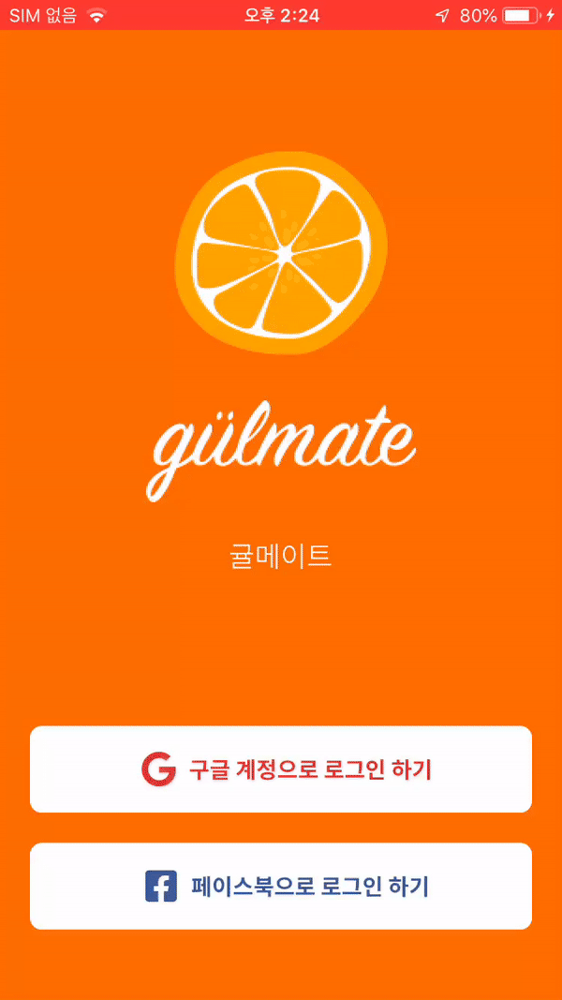
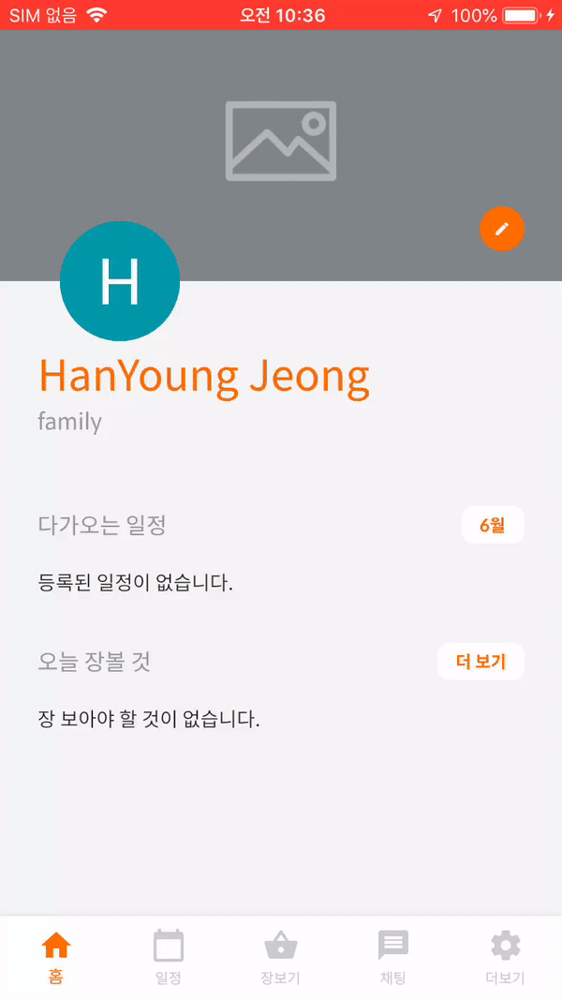
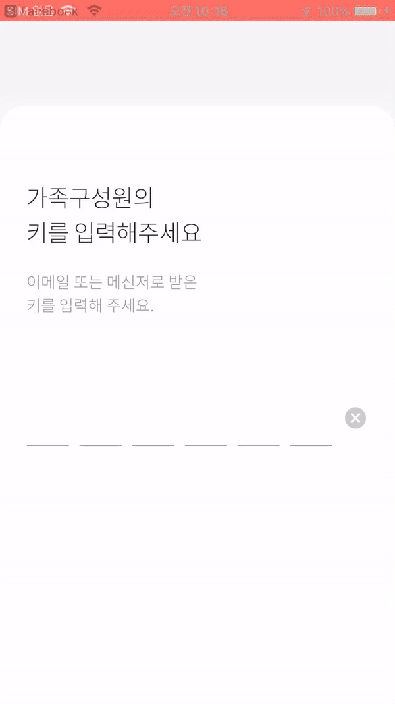

# 귤메이트 앱   

가족끼리의 일정 및 할일들을 공유할 수 있는 서비스입니다.

## 팀원 정보

**기획, 서버, 클라이언트**: [정한영](https://github.com/JungHanYoung)

## 앱 정보

- [x] 대쉬보드(최근일정, 오늘 할일, 읽지 않은 채팅 등)
- [x] 가족에서의 프로필 설정
- [x] 일정 CRUD
- [x] 할일 CRUD
- [x] 실시간 채팅
- [x] 배경사진 업로드
- [ ] 가족 앨범 갤러리

## 구동화면

**iPhone 6**에 빌드하여 화면 녹화를 하였습니다. (로컬 웹서버 구동, AWS S3 사진업로드)

### 구글 로그인과 페이스북 로그인 지원

### 가족 생성 및 코드를 통한 초대

### 할일(장보기) 추가 및 조회

### 가족 단위의 일정 추가 및 조회

### 대쉬보드 화면 및 가족프로필사진 추가 기능

### 실시간 채팅

