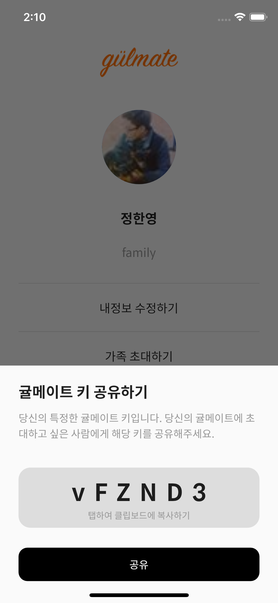
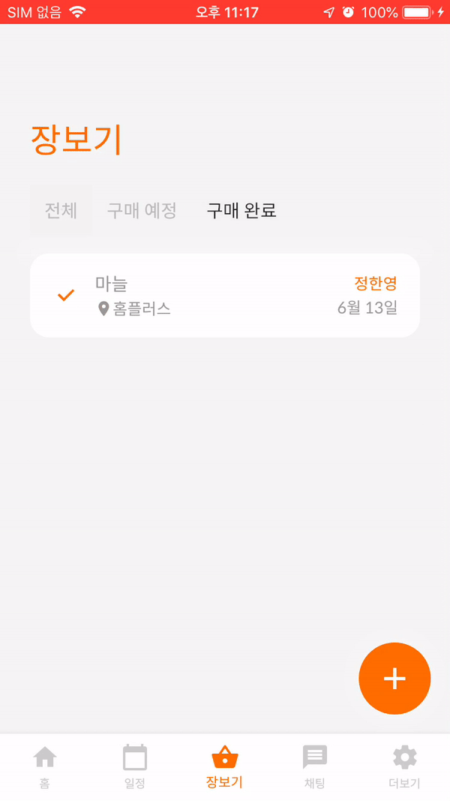
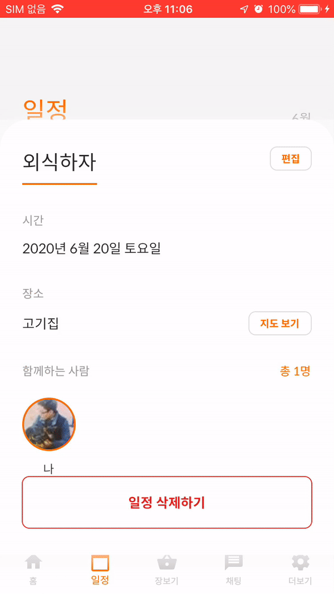

# 귤메이트 앱   

## 팀원 정보

**기획, 서버, 클라이언트**: 정한영

## 앱 정보

- 일정 공유
- TODO 공유
- 실시간 채팅
- 배경사진 업로드

### 구글 로그인과 페이스북 로그인 지원

### 가족 생성 및 코드를 통한 초대

### 할일(장보기) 추가 및 조회

### 가족 단위의 일정 추가 및 조회

### 대쉬보드 화면 및 가족프로필사진 추가 기능

### 실시간 채팅

